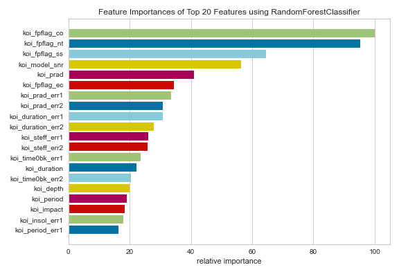
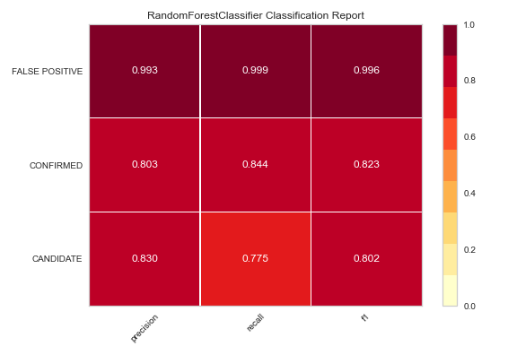
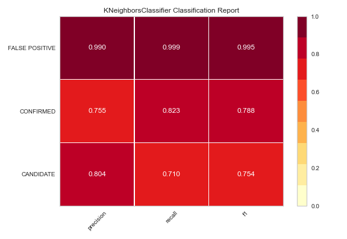
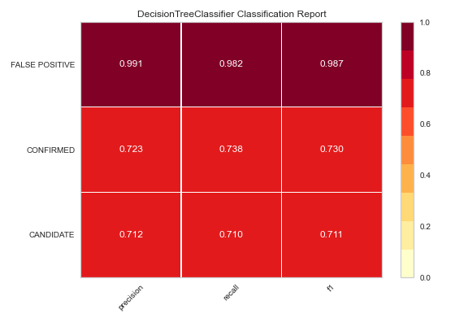
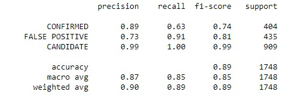
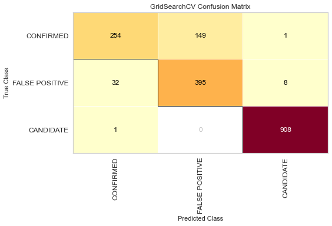

# machine-learning-challenge


 
**Machine Learning - Exoplanet Classification and Prediction Model**
---




## Table of contents
* [Project Title](#description)
* [Description](#description)
* [Objective](#objective)
* [Analysis 2020](#analysis-2020)
* [Technologies and Tools](#technologies-and-tools)
* [Code](#code)
* [Status](#status)
* [Contact](#contact)


## Project Title : Exoplanet Exploration ,Classification and Prediction

### Description 
This project aims at testing and tuning different Classification models to predict exoplanets from test data with maximum accuracy. 

### Data Set
 
Over a period of nine years in deep space, the NASA Kepler space telescope has been out on a planet-hunting mission to discover hidden planets outside of our solar system.

To help process this data, we will be creating  machine learning models capable of classifying candidate exoplanets from the raw dataset.
		

## Objective

### Step 1 - Preprocess the Data
1. Preprocess the dataset prior to fitting the model.
2. Perform feature selection and remove unnecessary features.
3. Use MinMaxScaler to scale the numerical data.
4. Separate the data into training and testing data.	
    
### Step 2 -Tune Model Parameters
1. Use GridSearch to tune model parameters.
2. Tune and compare at least two different classifiers.	

### Step 3 - Reporting
- Create a README that reports a comparison of each model's performance as well as a summary about your findings and any assumptions you can make based on your model (is your model good enough to predict new exoplanets? Why or why not? What would make your model be better at predicting new exoplanets?).


## Analysis 
__Preprocessing__ : Preprocessing involves feature engineering of dataset that selects minimum required features to produce a valid model because the more features makes the model susceptible to errors due to variance.

- __Feature Selection Model__ : Yellowbrick The [Yellowbrick FeatureImportances](https://www.scikit-yb.org/en/latest/api/model_selection/importances.html) visualizer with sklearn RandomForestClassifier
	* FeatureImportances uses a barplot to visualize the importance of each feature for prediction. 
	* Out of 40 features, I have selected top 20 features of importance.




__Classifiers__: 

- __Logistic Regression__ :
	* Training Data Score: 0.841
	* Testing Data Score: 0.861
	
- __RandomForest Classifier__ :
	* Training Data Score: 1.0
	* Testing Data Score: 0.91
	* Classification Report [Visualization with Yellowrick](https://www.scikit-yb.org/en/latest/api/classifier/classification_report.html)
	
	

- __KNN - K Nearest Neighbor Classifier__ :
	* Test Accuracy: 0.858
	* Classification Report [Visualization with Yellowrick](https://www.scikit-yb.org/en/latest/api/classifier/classification_report.html)
	
	

- __Decision Tree Classifier__ :
	* Training Data Score: 0.894
	* k=11 Test Accuracy: 0.888
	* Classification Report [Visualization with Yellowrick](https://www.scikit-yb.org/en/latest/api/classifier/classification_report.html)
	
	

- __SVM-Support vector machine Classifier__ :
	* SVM Test Accuracy: 0.858
	* __Hyperparameter Tuning__ : 
		* grid.best_params_ : {'C': 50, 'gamma': 0.0001}
		* grid.best_score_ : 0.869
	* Classification Report [Visualization with Yellowrick](https://www.scikit-yb.org/en/latest/api/classifier/classification_report.html)
	
	

	* Confusion Matrix [Visualization with Yellowrick](https://www.scikit-yb.org/en/latest/api/classifier/confusion_matrix.html)

	

### Conclusion
While Random Forest and KNN scored 90% and 88% each on prediction, their training score is higher than the test score. This means that data is overfitted and model has memorized the features.

I would prefer SVM with grid selection model as our preferred training model to classify and predict the exoplanets.



## Technologies and Tools
* Jupyter Notebook
Python Libraries and tools:
	* SKLearn 
	* Yellowrick Visualization	
	

## Code 
[Best Model](./Divya_Shetty.sav)


## Status
Project Complete


## Contact
 [Divya Shetty](https://github.com/divya-gh)


